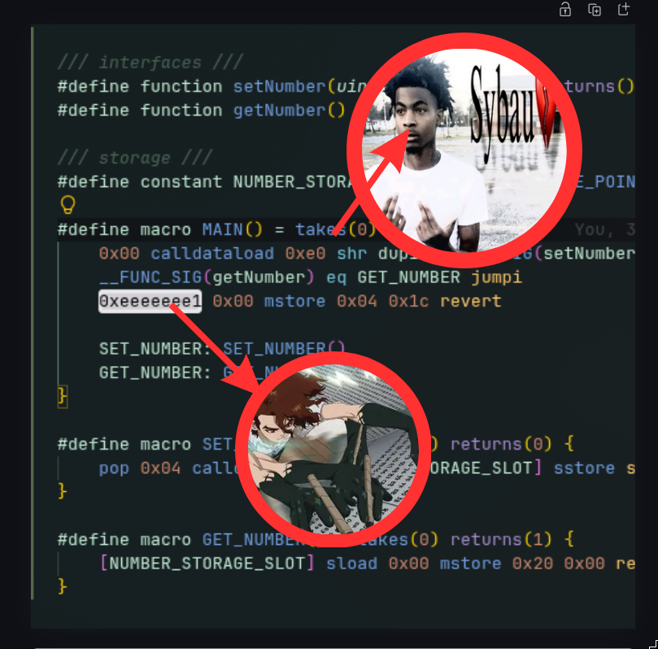

## Huff



Since i got so many interested in low level stuff so this huff learning teach me so much on how the actual of EVM works, and to be honest, its really really fun!

alright alright so in this kind of repo im just do bunch of stuff translating from `Counter.sol` the default guy from forge init project with some additional stuff to huff

`Counter.sol`

```solidity
// SPDX-License-Identifier: UNLICENSED
pragma solidity ^0.8.13;

import {ICounter} from "./interfaces/ICounter.sol";

contract Counter is ICounter {
    uint256 private number;

    function setNumber(uint256 newNumber) external {
        number = newNumber;
    }

    function getNumber() external view returns (uint256) {
        return number;
    }
}
```

`Counter.huff`

```huff
/// interfaces ///
#define function setNumber(uint256) nonpayable returns()
#define function getNumber() view returns(uint256)

/// storage ///
#define constant NUMBER_STORAGE_SLOT = FREE_STORAGE_POINTER()

#define macro MAIN() = takes(0) returns(0) {
    // slot 0 => uint256

    0x00 // [0]
    calldataload // [calldata 32]

    0xe0 // [e0, calldata]
    shr  // [func_sel]

    dup1 // [func_sel, func_sel]

    __FUNC_SIG(setNumber) // [setNumber, func_sel, func_sel]
    eq // [result_eq, func_sel]

    SET_NUMBER // [set_number_pc, result_eq, func_sel]
    jumpi // [func_sel]

    __FUNC_SIG(getNumber) // [getNumber, func_sel]
    eq // [result_eq, func_sel]

    GET_NUMBER // [get_number_pc, func_sel]
    jumpi // []

    0xeeeeeee1 0x00 mstore // err bytes msg
    0x04 0x1c revert // revert with 4 bytes with 0x1c offset (28 bytes)

    // setNumber(uint256) selector = 0x3fb5c1cb
    SET_NUMBER:
        SET_NUMBER()

    // getNumber() selector = 0xf2c9ecd8
    GET_NUMBER:
        GET_NUMBER()
}

#define macro SET_NUMBER() = takes(1) returns(0) {
    pop
    0x04 calldataload
    [NUMBER_STORAGE_SLOT] sstore
    stop
}

#define macro GET_NUMBER() = takes(0) returns(1) {
    [NUMBER_STORAGE_SLOT] sload // load slot 0
    0x00 mstore // push to memory
    0x20 0x00 return // return 32 bytes with offset 0 from mem
}
```

hoho please ignore that silly comment thing, just for make me clear on whats going on in the stack, so from this lesson i got the new insight about how solidity complied to bytecode, in first place i though was that `receive()` and `fallback()` thing from solidity as i had been told, and through my process of thinking it was just a black magic, or is it just a default? like why every solidity should have this default behaviour, but comes to learning this low level stuff now i know that solc did that without telling to us they did

conratulations for me!! its quite fun do this thing whole day
